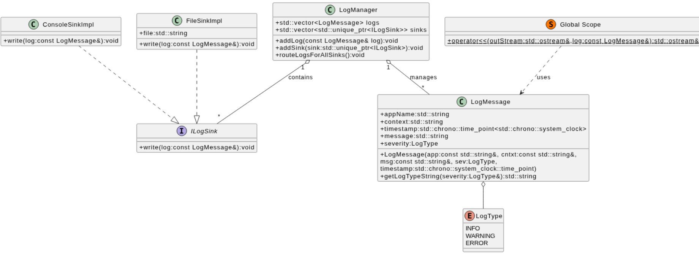

# Telemetry & Logging System(TeleLog)

## System Architecture


---

## Output
> https://github.com/user-attachments/assets/dd950301-7ee6-42ce-aa6f-4a629454b03b

---

## Design Patterns in Generated CommonAPI Files
**GpuUsageData Interface — omnimetron.gpu**

The CommonAPI code generator produces a set of files from the `.fidl` and `.fdepl` definitions. Each file has a specific architectural role, and together they embody several well-known design patterns.

---

### 1. Proxy Pattern

Provides a surrogate object that controls access to the remote service running in a separate process.

| File | Role |
|------|------|
| `GpuUsageDataProxyBase.hpp` | **Subject / Abstract Interface** — declares `requestGpuUsageData()` and `getNotifyGpuUsageDataChangeEvent()` as pure virtual methods |
| `GpuUsageDataProxy.hpp` | **Proxy** — implements the Subject interface and forwards every call to the real implementation via `delegate_` |
| `GpuUsageDataSomeIPProxy.hpp` | **Real Subject** — the concrete SomeIP implementation that serialises and sends messages over the network |

`GpuUsageDataProxy` holds a `shared_ptr<GpuUsageDataProxyBase>` called `delegate_`. Every method simply forwards to it:

```cpp
void GpuUsageDataProxy::requestGpuUsageData(...) {
    delegate_->requestGpuUsageData(...);   // forwarded to SomeIPProxy
}
```

The client (`SomeIPTelemetrySourceImpl`) only ever sees `GpuUsageDataProxy` — it has no knowledge of SomeIP, serialisation, or the network transport.

---

### 2. Bridge Pattern

Decouples an abstraction from its implementation so that the two can vary independently.

| File | Role |
|------|------|
| `GpuUsageDataProxy.hpp` | **Abstraction** — the stable interface the application code depends on |
| `GpuUsageDataProxyBase.hpp` | **Implementor** — the abstract base that any binding (SomeIP, D-Bus, …) must implement |
| `GpuUsageDataSomeIPProxy.hpp` | **Concrete Implementor** — the SomeIP binding |

`GpuUsageDataProxy` stores the implementor through a pointer-to-abstract-base (`delegate_`). Swapping the transport from SomeIP to D-Bus requires only a new Concrete Implementor — the Abstraction and all client code remain unchanged. The template parameter pack `<_AttributeExtensions...>` allows additional capability to be mixed in without modifying either side of the bridge.

---

### 3. Observer Pattern (Event / Broadcast)

Defines a one-to-many dependency: when the subject (service) changes state, all registered observers are notified automatically.

| File | Role |
|------|------|
| `GpuUsageDataProxyBase.hpp` | **Subject Interface** — exposes `NotifyGpuUsageDataChangeEvent` and `getNotifyGpuUsageDataChangeEvent()` |
| `GpuUsageDataSomeIPProxy.hpp` | **Concrete Subject** — owns the SomeIP Event object that fires the notification |
| `GpuUsageDataStub.hpp` | **Publisher** — calls `fireNotifyGpuUsageDataChangeEvent(usage)` to broadcast a new value |
| `SomeIPTelemetrySourceImpl` | **Concrete Observer** — calls `.subscribe(lambda)` to register and react to each event |

The service fires the event:
```cpp
service->fireNotifyGpuUsageDataChangeEvent(gpuUsage);
```

The client subscribes at startup and receives every broadcast without polling:
```cpp
proxy->getNotifyGpuUsageDataChangeEvent().subscribe(
    [this](const float gpuUsage) { eventHandler(to_string(gpuUsage)); });
```

This replaces the polling loop (`requestGpuUsageData` every N seconds) with a true push model — the observer is called only when data actually changes.

---

### 4. Template Method Pattern

Defines the skeleton of an algorithm in a base class, deferring specific steps to subclasses.

| File | Role |
|------|------|
| `GpuUsageDataStub.hpp` | **Abstract Class** — declares `requestGpuUsageData()` as pure virtual; provides `fireNotifyGpuUsageDataChangeEvent()` as a concrete template step |
| `GpuUsageDataStubDefault.hpp` | **Concrete Class (default)** — provides a no-op implementation of every virtual step |
| `GpuService` (gpuService.cpp) | **Concrete Class (application)** — overrides `requestGpuUsageData()` with real GPU logic |

`GpuUsageDataStubDefault` provides safe default implementations so the developer only overrides what they care about:

```cpp
class GpuService : public GpuUsageDataStubDefault {
    void requestGpuUsageData(..., reply_t reply) override {
        reply(randomGpuUsage());   // only this step is customised
    }
};
```

---

### Summary

| Pattern | Where | Purpose |
|---------|-------|---------|
| **Proxy** | `GpuUsageDataProxy` | Hides remote transport from client |
| **Bridge** | `Proxy` + `ProxyBase` + `SomeIPProxy` | Decouples interface from binding |
| **Observer** | `NotifyGpuUsageDataChangeEvent` | Push-based GPU event delivery |
| **Template Method** | `GpuUsageDataStub` / `StubDefault` | Service skeleton — override only what you need |

---

## ThreadPool Workflow
```
main thread
│
│  pool.push(taskA)
│    ├─ lock queue
│    ├─ enqueue taskA
│    ├─ unlock queue
│    └─ notify_one() ──────────────► one sleeping worker wakes up
│                                         │
│  pool.push(taskB)                       ├─ locks mutex
│    ├─ lock queue                        ├─ sees tasks.empty() == false
│    ├─ enqueue taskB                     ├─ pops taskA
│    ├─ unlock queue                      ├─ unlocks mutex
│    └─ notify_one() ──────────► another worker wakes up
│                                    │    │
│                                    │    └─ executes taskA()
│                                    │        (no lock held during execution)
│                                    │
│                                    ├─ locks mutex
│                                    ├─ pops taskB
│                                    ├─ unlocks mutex
│                                    └─ executes taskB()
```

> When stop == true
```
Destructor called
│
├─ stop = true
└─ notify_all()
        │
        ├──► Worker 1 wakes
        │       ├─ sees stop=true  →  doesn't exit yet
        │       ├─ sees tasks.empty()==false
        │       ├─ pops & runs taskX   ← still executes!
        │       ├─ loops back
        │       ├─ sees stop=true AND tasks.empty()==true
        │       └─ returns  ✓
        │
        ├──► Worker 2 wakes
        │       ├─ sees stop=true
        │       ├─ sees tasks.empty()==false
        │       ├─ pops & runs taskY   ← still executes!
        │       ├─ loops back
        │       ├─ sees stop=true AND tasks.empty()==true
        │       └─ returns  ✓
        │
        └──► Worker 3 wakes
                ├─ sees stop=true AND tasks.empty()==true(nothing left)
                └─ returns immediately  ✓

main thread: all workers joined → pool destroyed safely
```

---

## Notes

### 1. `std::ostream`

`std::ostream` is the **base class for output streams** in C++.

- Examples of `std::ostream` objects:
  - `std::cout` → console output
  - `std::ofstream` → file output

#### 	Why it's useful here?

- Both `std::ofstream`(file) and `std::cout`(console) are **subclasses of `std::ostream`**.
- Because you overloaded `operator<<` for `LogMessage` **on `std::ostream&`**, it **works for any output stream**.
- **No need to duplicate formatting code** for console vs file — the same `operator<<` handles both.

---

### 2. Strategy Design Pattern

It is a behavioral design pattern that allows you to define a family of algorithms, encapsulate each one in a separate class, and make them interchangeable. This lets the algorithm vary independently from the clients that use it.

Instead of implementing a single class that handles multiple variations of a task using complex conditional logic(like `if-else` or `switch` statements), you delegate the task to one of several specialized strategy objects.

#### Core Components

* **Strategy(Interface):** A common interface for all supported algorithms. It declares a method that the Context uses to execute a strategy.
* **Concrete Strategies:** Classes that implement the Strategy interface using a specific algorithm(e.g., `ConsoleSink` or `FileSink` in your project).
* **Context:** The class that maintains a reference to a Strategy object. It doesn't know the details of how the strategy works; it simply triggers the strategy’s method.

#### Why Use It?

* **Avoids Conditionals:** You can eliminate massive blocks of `if/else` or `switch` statements used to select different behaviors.
* **Open/Closed Principle:** You can introduce new strategies(like a `DatabaseLogger`) without having to change the Context or other existing strategies.
* **Runtime Flexibility:** The Context can switch its behavior at any time by simply swapping the strategy object it is currently holding.
* **Isolation:** The implementation details of an algorithm are hidden away from the code that uses it.

#### Usage:

| **Class / File**          | **Role in Strategy Pattern** | **Description**                                              |
| ------------------------- | ---------------------------- | ------------------------------------------------------------ |
| **`ILogSink.hpp`**        | **Strategy Interface**       | Defines the common behavior(`write`) that all concrete strategies must implement. |
| **`ConsoleSinkImpl.hpp`** | **Concrete Strategy**        | Implements the `write` method to send output specifically to the console. |
| **`FileSinkImpl.hpp`**    | **Concrete Strategy**        | Implements the `write` method to handle logging to a physical file. |
| **`LogManager`**          | **Context**                  | Holds references to `ILogSink` and delegates the logging task to the active strategy. |

---

### 3. `SafeFile`/`SafeSocket` Classes
- They are purely a RAII wrapper for file descriptors/sockets. Its job is ownership management: open/socket,connect, close, move-only semantics. 
- It should not implement higher-level logic like reading, that’s the responsibility of the telemetry source classes `FileTelemetrySourceImpl`/`SocketTelemetrySourceImpl`.

---

### 4. `std::optional<SafeFile>`
- Allows delayed initialization, so `FileTelemetrySourceImpl` can have a default constructor, satisfying Rule-of-Zero.
- `file.emplace("source.txt")`: This constructs in-place and avoids an unnecessary move, used with std::optional

---

### 5. `noexcept`
- on move = enables optimizations and fits standard container requirements.
- Without it, moves might silently degrade into copies in std::vector, std::map, etc.
- Rule: If your move cannot throw, always mark it noexcept.

---

### 6. UNIX Domain Socket
##### A mechanism for inter-process communication(IPC) on the same host, using the file system namespace instead of network addresses.
##### Key points:
- Works only within one machine
- Uses filesystem paths to identify endpoints, not IP addresses or ports
- Supports stream(SOCK_STREAM) or datagram(SOCK_DGRAM) semantics
- Faster than TCP/IP sockets for local IPC(no network stack overhead)
##### Typical workflow
- For client-side:
  - socket(AF_UNIX, SOCK_STREAM, 0) → create socket
  - connect() → connect to server using sockaddr_un
  - read() / write() → send/receive data
  - close() → cleanup

- For server-side:
  - socket(AF_UNIX, SOCK_STREAM, 0) → create socket
  - bind() → bind to a path(like /tmp/telemetry.sock)
  - listen() → listen for clients
  - accept() → accept connections
  - read() / write() → communicate
  - close() → cleanup

---

### 7. UML Relations
#### UML Relationship Comparison

| Relationship | UML Notation | Meaning | Ownership | Lifetime Dependency | Typical C++ Usage |
|-------------|-------------|--------|-----------|---------------------|------------------|
| **Inheritance** | `--|>` | “Is-a” relationship between base and derived classes | ❌ No | ❌ No | `class A : public B` |
| **Interface Implementation** | `..|>` | Class implements an interface | ❌ No | ❌ No | `class Impl : public Interface` |
| **Composition** | `*--` | Strong ownership(part cannot exist without whole) | ✅ Yes | ✅ Yes | RAII member objects |
| **Aggregation** | `o--` | Weak ownership(part can exist independently) | ⚠️ Shared | ❌ No | Containers of pointers / smart pointers |
| **Association** | `--` | General relationship / knows about | ❌ No | ❌ No | References, pointers |
| **Dependency(Uses)** | `..>` | Temporary usage | ❌ No | ❌ No | Function parameters, return values |
| **Enum Association** | `o--` | Class uses an enum | ❌ No | ❌ No | Enum as data member |


---

### 8. Policy

A policy is a template parameter that defines rules or behavior for a generic class—in this case, LogFormatter.
Instead of hardcoding logic for CPU, RAM, GPU, etc., a policy:
- Encapsulates context, units, and thresholds.
- Provides a static method to infer severity based on a value.
- Lets LogFormatter work generically for any telemetry source.
So the policy is a way of customizing the behavior of the formatter without modifying the formatter code itself.

---

### 9. `magic_enum`

1. No manual mapping

You don’t need to write and maintain:

``` cpp
switch(src) {
    case TelemetrySrc_enum::CPU: return "CPU Usage";
    ...
}
```

`magic_enum` converts `enums` → `strings` automatically.

2. Refactor-safe

If you add a new enum value(e.g. DISK),
you won’t forget to update the switch(a very common bug).

3. Cleaner code

``` cpp
magic_enum::enum_name(TelemetrySrc_enum::CPU); // "CPU"`
```

4. Compile-time, zero runtime cost

It’s header-only and mostly constexpr

No performance penalty

---

### 10. Ring-Buffer

It's like a `circular-queue`

| Feature          | Ring Buffer        | std::vector        |
|------------------|--------------------|--------------------|
| Memory usage     | Fixed              | Grows dynamically  |
| Real-time safe   | ✅ Yes             | ❌ No(reallocations) |
| Overwrites old   | Optional           | ❌ No              |
| Embedded use     | 🔥 Very common     | Meh                |

---

### 11. ThreadPool

A **Thread Pool** is a concurrency pattern where a fixed set of worker threads is created once and reused to execute multiple tasks, rather than spawning a new thread for every task.

#### - How It Works

```
push(task)
    │
    ▼
[ Task Queue ] ──► Worker Thread 1
               ──► Worker Thread 2
               ──► Worker Thread 3
```

Tasks are submitted to a shared queue. Idle workers compete to pick them up and execute them. When a worker finishes, it goes back to waiting for the next task.

#### - Core Components

| Component | Role |
|---|---|
| `vector<thread>` | The fixed pool of reusable worker threads |
| `queue<function<void()>>` | Pending tasks waiting to be picked up |
| `mutex` | Protects the queue from concurrent access |
| `condition_variable` | Puts idle workers to sleep and wakes them when work arrives |
| `push()` | Submits a new task into the queue |
| `stop` flag | Signals workers to exit cleanly on destruction |

---

#### - Advantages Over Raw Threads

##### No thread creation overhead
Creating a thread is expensive — it allocates a stack and registers with the OS. With a pool, threads are created **once** at startup and reused for every task thereafter.

##### Automatic lifecycle management
Raw threads require manual `.join()` on every thread, and forgetting one causes undefined behavior. The pool destructor handles all joins automatically in one place.

##### Controlled resource usage
Raw threads let you accidentally spawn hundreds of threads under load. The pool **caps** the number of concurrent threads, preventing resource exhaustion and excessive context switching.

##### Scales easily with more tasks
Adding a new task with raw threads means declaring a new `std::thread`, managing its lifetime, and joining it manually. With a pool, it's one `push()` call — the pool absorbs it with no extra management.

##### Clean, centralized shutdown
With raw threads, stopping everything cleanly requires careful coordination across all threads. The pool centralizes this — one `stop` flag, one `notify_all()`, one destructor.
